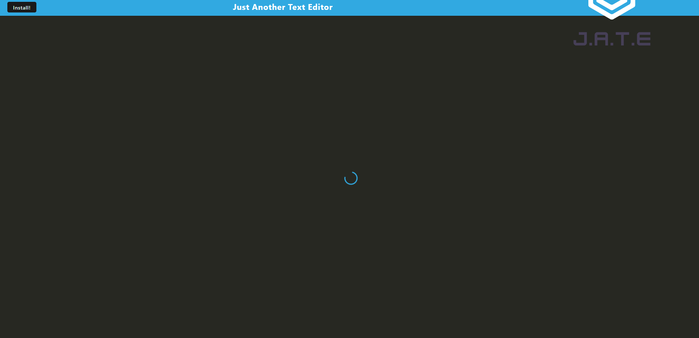

# text-editor
## Description
-Be able to create notes or code snippets while not being connected to the internet, you can save these notes and use them at a later date

## Installation
- you can view the application here - https://afternoon-brook-52520-d3b946588b31.herokuapp.com
- or you can run it locally by git cloning this repo at - https://github.com/Edesp1/text-editor
- do npm i to download all the dependencies and then run node server.js to start the server

## usage
 

## Collaborations
-Collaborations for this project are closed until further notice thank you ! :D

## License
- This project is under the MIT License

## badges
